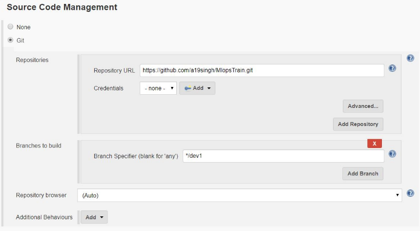
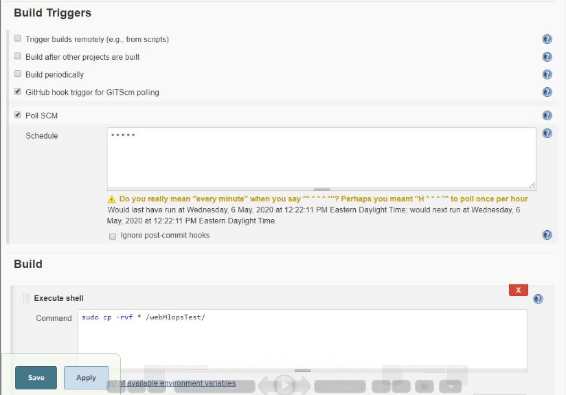
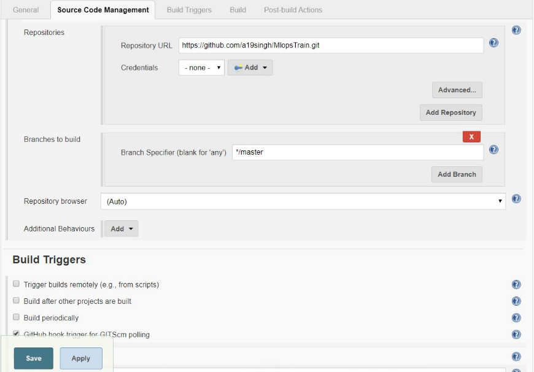
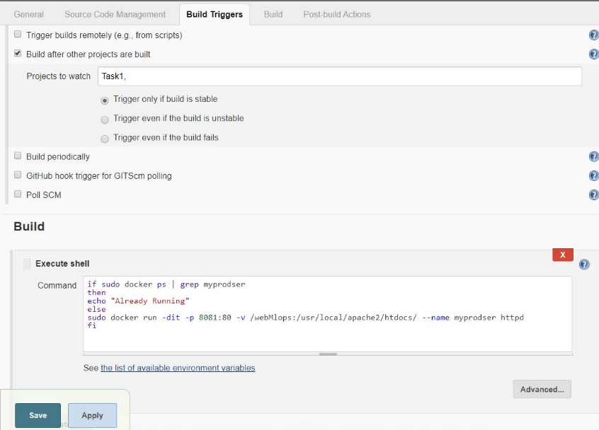
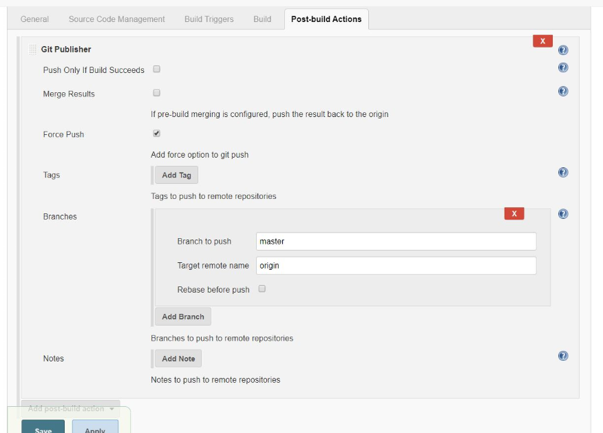

task1 - build ci/cd model - basic

06/05/2020 21:45
* * *

## Steps to reproduce:
### Pre-steps
For Github Repo:
1. Initiate repo
2. make some base code (in master branch)
3. create a branch for developer (say, dev1)
4. add, commit and push

For Server:
1. install jenkins and start the service
2. install docker engine and start it

### Steps :
Developer end:
1. clone the repo
2. checkout to dev1 branch
3. add, commit, push

Server end:
1. create 3 jenkins job(job1, job2, job3) - freestyle type.

2. configure job1 to - 
 - check for changes from github repo(Poll SCM - for dev1 branch)
 - copy the downloaded data to some different location (say, /mywebdev1)
 

3. configure job2 to - 
 - map this volume to docker container and test it (hint: use curl).
 - if test is passed then
	 - use git publisher to merge the dev branch to master branch
	 - and push the branch to github

4. Configure job3 to -
 -  check for changes from github repo (Poll SCM - for master branch)
 - copy the downloaded data to another repo (say /mywebmaster)
 - map the volume to docker container and use PATing(Port Address Translation) to expose the ports.
 

5. Now your new changes are reflecting on the website