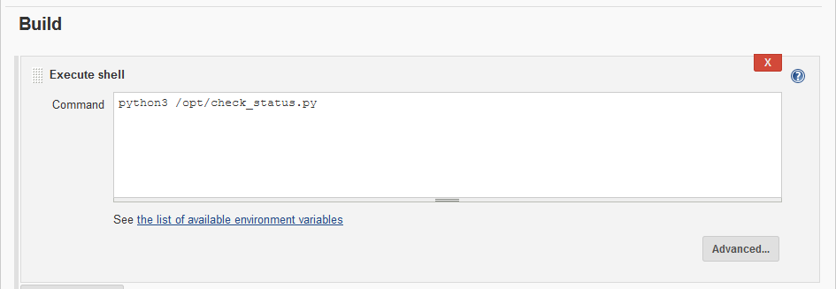

task2

11/05/2020 20:25

* * *
# Task2
* * *
- [x] Create container image that’s has Jenkins installed  using dockerfile 

- [x] When we launch this image, it should automatically starts Jenkins service in the container.

- [x] Create a job chain of job1, job2, job3 and  job4 using build pipeline plugin in Jenkins 

- [x] Job1 : Pull  the Github repo automatically when some developers push repo to Github.

- [x] Job2 : By looking at the code or program file, Jenkins should automatically start the respective language interpreter install image container to deploy code ( eg. If code is of  PHP, then Jenkins should start the container that has PHP already installed ).

- [x] Job3 : Test your app if it  is working or not.

- [x] Job4 : if app is not working , then send email to developer with error messages.

- [x] Create One extra job job5 for monitor : If container where app is running. fails due to any reson then this job should automatically start the container again.

* * * 
# MY VISUALS


* * *
# MY SOLUTION
* * * 
## Check for internet connectivity
#Masquerading allows for docker ingress and egress
- firewall-cmd --zone=public --add-masquerade --permanent
- firewall-cmd --reload
#Restart docker
- systemctl restart docker

* * *
## Here the fun begins

- create a bridged network --> test2net


check it


- build jenkins image
	- important link : https://www.jenkins.io/doc/pipeline/tour/getting-started/

docker fie content (added some of my personal scripts too)


```
docker build -t myjenkins:v1 -f "jenkins.dockerfile" .
```

- create jenkins container
	- mapped dot files (for initialsecrets, and plugins settings and data)
	- mapped gitclones files (files downloaded from github as persistent between storages)
	- mapped docker socket to container (to control docker daemon from inside the container)
	- attached to the network.

```
docker run -dit  -v /root/task2/dotjenkins/:/root/.jenkins/ -v gitclones:/gitclones/ -v /var/run/docker.sock:/var/run/docker.sock --network test2net  --name try_jenkins -p 8080:8080 myjenkins:v1
```


- jenkins jobs


create 5 jobs


build pipeline for 4 jobs


* * * 
- job1

download data from github whenever new version arrives


(was trying for webhooks, BAD LUCK there -- so used POLL scm instead )


save it in /gitclones (persistent storage)


- job2

build after job1 is done


apply magicfile.py to gitclones directory (read the code below)


(`magicfile.py` -- not so magical afterall -- simple python tricks)


- job3

build after job2


run checkstatus.py file (read code below)


(check_status.py)


- job4

build after job3


check for /status file (if SEND MAIL in it)... If yes, then send mail to ris3234@gmail.com(developer mail id)


(`sendmail.py` -- credentials hidden)


- job5

build after job4


will update the restart policy for every running container


* * *
SNAPSHOTS OF ALL FILES
* * * 

(`python.dockerfile`)


(`php.dockerfile`)


(`magicfile.py`)


(`jenkins.dockerfile`)


(`docker.repo`)


(`check_status.py`)


